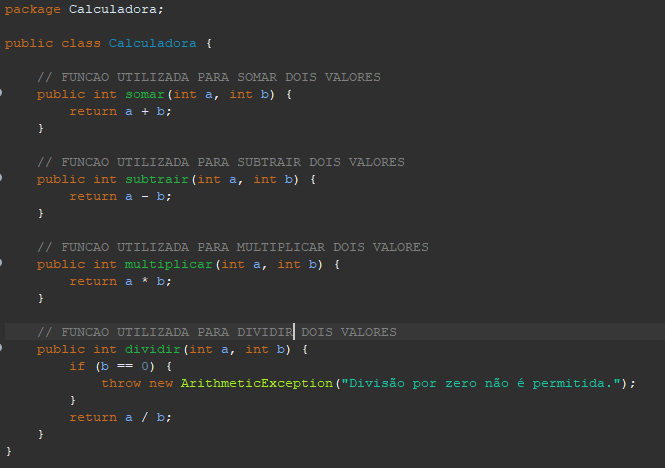

# Calculadora Básica em JAVA

## Descrição
Este projeto consiste em uma calculadora utilizando a linguagem JAVA para solucionar cálculos básico, sendo eles de adição, subtração, multiplicação e divisão.

